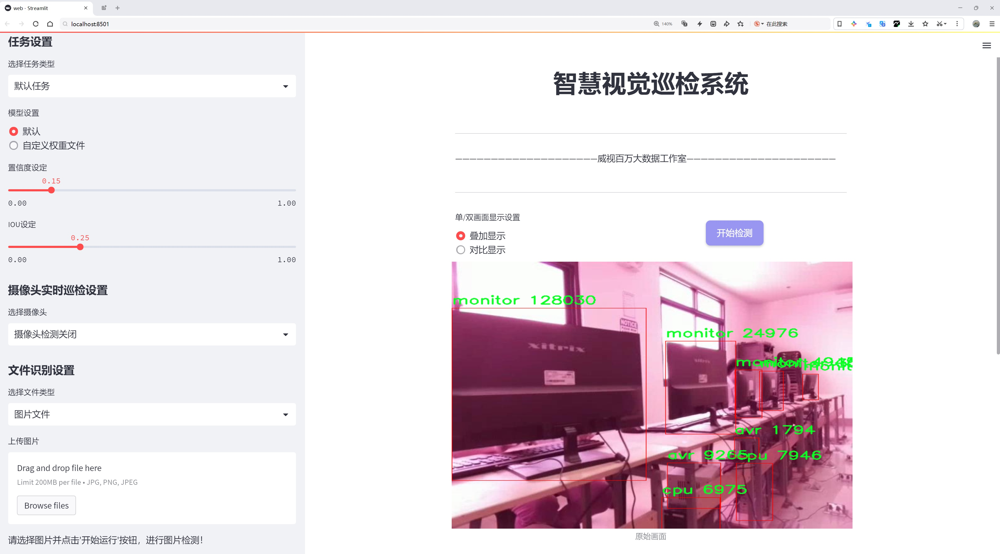
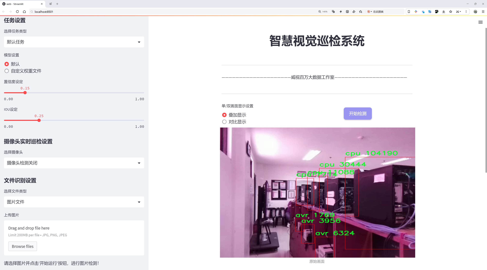
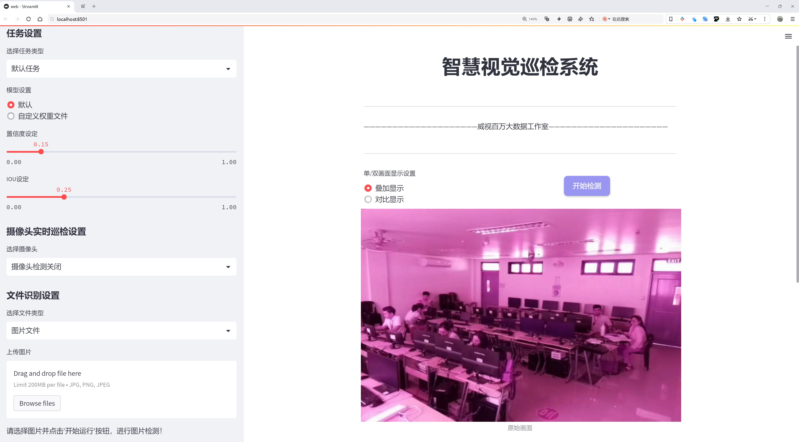
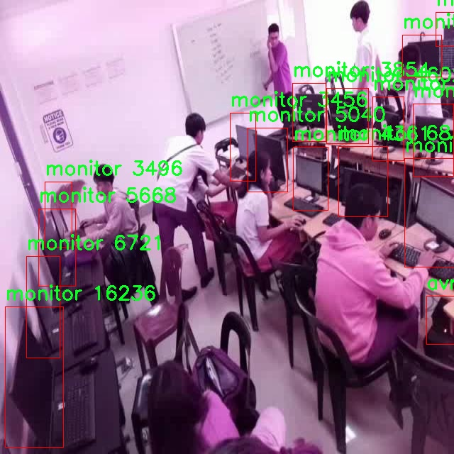
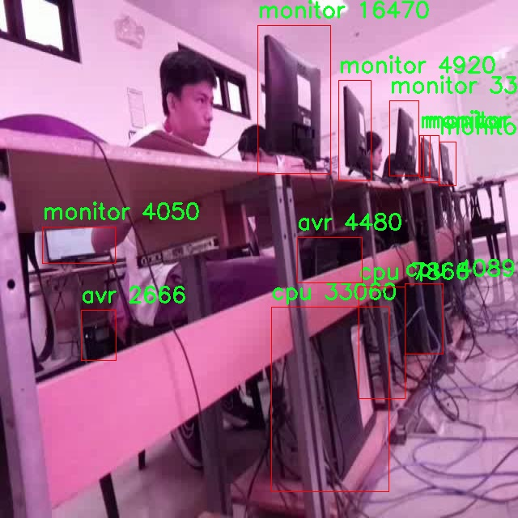
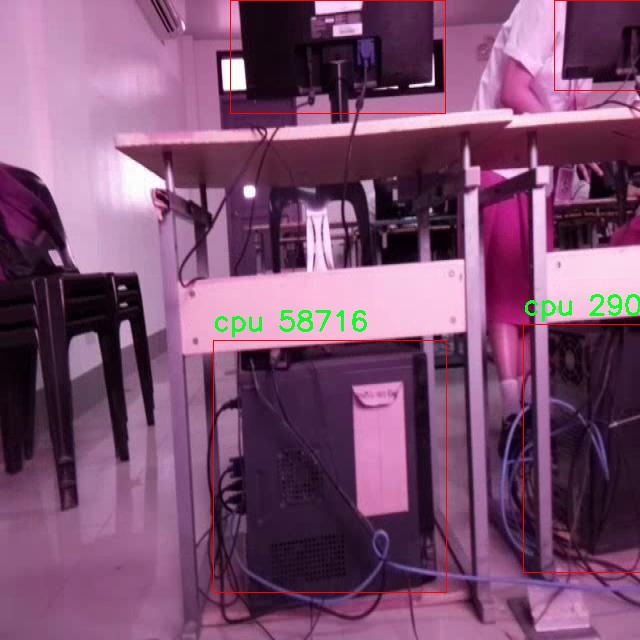
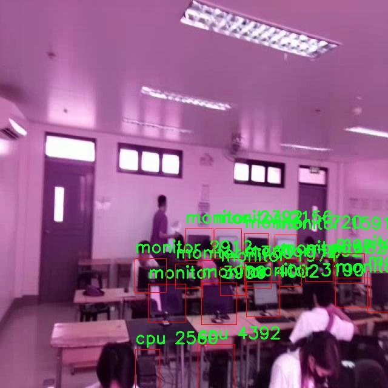
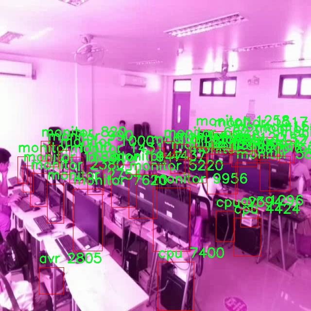

# 热源检测检测系统源码分享
 # [一条龙教学YOLOV8标注好的数据集一键训练_70+全套改进创新点发刊_Web前端展示]

### 1.研究背景与意义

项目参考[AAAI Association for the Advancement of Artificial Intelligence](https://gitee.com/qunmasj/projects)

项目来源[AACV Association for the Advancement of Computer Vision](https://kdocs.cn/l/cszuIiCKVNis)

研究背景与意义

随着科技的迅猛发展，热源检测技术在多个领域中发挥着越来越重要的作用，尤其是在工业监测、环境保护、智能家居和安全防范等方面。传统的热源检测方法往往依赖于人工观察和简单的热成像设备，这不仅效率低下，而且容易受到人为因素的影响，导致检测结果的不准确。因此，开发一种高效、准确的热源检测系统显得尤为重要。近年来，深度学习技术的快速发展为图像识别和目标检测提供了新的解决方案，尤其是YOLO（You Only Look Once）系列模型在实时目标检测方面展现出了优异的性能。

本研究旨在基于改进的YOLOv8模型，构建一个高效的热源检测系统。YOLOv8作为YOLO系列的最新版本，具有更高的检测精度和更快的处理速度，能够满足实时监测的需求。通过对YOLOv8模型的改进，我们可以进一步提升其在热源检测任务中的表现，尤其是在复杂环境下的检测能力。此外，热源检测系统的准确性和实时性将直接影响到其在实际应用中的效果，如在工业设备的故障预警、环境监测中的温度异常检测等。

本研究所使用的数据集ThermoCam包含9810张图像，涵盖了三类热源：avr（平均温度）、cpu（中央处理器温度）和monitor（监视器温度）。这些类别的选择反映了现代电子设备中常见的热源类型，能够为系统的训练和测试提供丰富的样本。通过对这些图像的分析，我们可以提取出不同热源的特征信息，从而提高模型的识别能力和准确性。此外，数据集的规模和多样性为模型的泛化能力提供了良好的基础，确保其在实际应用中能够有效应对不同的场景和条件。

热源检测系统的研究不仅具有理论意义，还具有广泛的实际应用价值。在工业领域，实时监测设备的温度变化可以有效预防设备故障，降低生产损失；在环境保护方面，及时发现异常热源可以帮助监测和控制环境污染；在智能家居中，热源检测技术可以提升家庭安全，防止火灾等意外事故的发生。因此，基于改进YOLOv8的热源检测系统的研究将为各个领域的智能监测和管理提供重要的技术支持。

综上所述，本研究不仅在理论上推动了热源检测技术的发展，同时也为实际应用提供了可行的解决方案。通过改进YOLOv8模型，结合丰富的数据集，我们期望能够实现一个高效、准确的热源检测系统，为各行业的智能化发展贡献力量。

### 2.图片演示







##### 注意：由于此博客编辑较早，上面“2.图片演示”和“3.视频演示”展示的系统图片或者视频可能为老版本，新版本在老版本的基础上升级如下：（实际效果以升级的新版本为准）

  （1）适配了YOLOV8的“目标检测”模型和“实例分割”模型，通过加载相应的权重（.pt）文件即可自适应加载模型。

  （2）支持“图片识别”、“视频识别”、“摄像头实时识别”三种识别模式。

  （3）支持“图片识别”、“视频识别”、“摄像头实时识别”三种识别结果保存导出，解决手动导出（容易卡顿出现爆内存）存在的问题，识别完自动保存结果并导出到tempDir中。

  （4）支持Web前端系统中的标题、背景图等自定义修改，后面提供修改教程。

  另外本项目提供训练的数据集和训练教程,暂不提供权重文件（best.pt）,需要您按照教程进行训练后实现图片演示和Web前端界面演示的效果。

### 3.视频演示

[3.1 视频演示](https://www.bilibili.com/video/BV1iZxueLEh4/)

### 4.数据集信息展示

##### 4.1 本项目数据集详细数据（类别数＆类别名）

nc: 3
names: ['avr', 'cpu', 'monitor']


##### 4.2 本项目数据集信息介绍

数据集信息展示

在现代计算机视觉领域，热源检测系统的研究与应用正日益受到重视。为了提升YOLOv8在热源检测任务中的性能，我们构建了一个名为“ThermoCam”的数据集，旨在为该系统的训练提供丰富而多样的样本。该数据集包含三种主要类别，分别是“avr”（音频视频接收器）、“cpu”（中央处理单元）和“monitor”（显示器），这些类别涵盖了在实际应用中常见的热源目标。通过对这些类别的精细标注和分类，我们期望能够提高YOLOv8在不同热源检测场景下的识别准确性和鲁棒性。

“ThermoCam”数据集的构建过程经过了严格的设计与实施。首先，我们在多种环境下收集了大量的图像数据，确保数据集的多样性和代表性。这些图像不仅包括不同角度和距离下的热源目标，还涵盖了不同的光照条件和背景环境，以模拟真实世界中可能遇到的各种情况。其次，为了保证数据的质量，我们对每一张图像进行了精确的标注，确保每个热源目标的边界框和类别信息都准确无误。这一过程不仅需要专业的知识和经验，还需要对热源检测的特性有深入的理解。

在数据集的类别设置上，我们选择了“avr”、“cpu”和“monitor”这三种热源目标，主要是因为它们在日常生活和工业应用中非常常见。音频视频接收器（avr）作为一种电子设备，通常在工作时会产生显著的热量；中央处理单元（cpu）是计算机的核心部件，其热量的变化直接影响系统的性能和稳定性；而显示器（monitor）则是用户与计算机交互的重要界面，其在长时间使用过程中也会发热。这三种类别的选择不仅具有代表性，也为模型的训练提供了多样化的样本，使得模型能够在不同场景下表现出更好的适应性。

在数据集的规模方面，“ThermoCam”数据集包含了数千张标注图像，确保了模型在训练过程中的充分学习。我们采用了数据增强技术，以进一步扩展数据集的有效样本数量，从而提高模型的泛化能力。这些增强技术包括随机裁剪、旋转、翻转以及颜色变换等，旨在模拟不同的拍摄条件和环境变化，帮助模型更好地适应现实世界中的复杂情况。

总之，“ThermoCam”数据集的构建为改进YOLOv8的热源检测系统提供了坚实的基础。通过精心设计的类别设置和丰富的样本数据，我们希望能够推动热源检测技术的发展，提高其在实际应用中的效果和可靠性。随着数据集的不断完善和模型的持续优化，我们期待在热源检测领域取得更大的突破，为相关行业的智能化发展贡献力量。











### 5.全套项目环境部署视频教程（零基础手把手教学）

[5.1 环境部署教程链接（零基础手把手教学）](https://www.ixigua.com/7404473917358506534?logTag=c807d0cbc21c0ef59de5)


[5.2 安装Python虚拟环境创建和依赖库安装视频教程链接（零基础手把手教学）](https://www.ixigua.com/7404474678003106304?logTag=1f1041108cd1f708b01a)

### 6.手把手YOLOV8训练视频教程（零基础小白有手就能学会）

[6.1 手把手YOLOV8训练视频教程（零基础小白有手就能学会）](https://www.ixigua.com/7404477157818401292?logTag=d31a2dfd1983c9668658)

### 7.70+种全套YOLOV8创新点代码加载调参视频教程（一键加载写好的改进模型的配置文件）

[7.1 70+种全套YOLOV8创新点代码加载调参视频教程（一键加载写好的改进模型的配置文件）](https://www.ixigua.com/7404478314661806627?logTag=29066f8288e3f4eea3a4)

### 8.70+种全套YOLOV8创新点原理讲解（非科班也可以轻松写刊发刊，V10版本正在科研待更新）

由于篇幅限制，每个创新点的具体原理讲解就不一一展开，具体见下列网址中的创新点对应子项目的技术原理博客网址【Blog】：


[8.1 70+种全套YOLOV8创新点原理讲解链接](https://gitee.com/qunmasj/good)

### 9.系统功能展示（检测对象为举例，实际内容以本项目数据集为准）

图9.1.系统支持检测结果表格显示

  图9.2.系统支持置信度和IOU阈值手动调节

  图9.3.系统支持自定义加载权重文件best.pt(需要你通过步骤5中训练获得)

  图9.4.系统支持摄像头实时识别

  图9.5.系统支持图片识别

  图9.6.系统支持视频识别

  图9.7.系统支持识别结果文件自动保存

  图9.8.系统支持Excel导出检测结果数据


### 10.原始YOLOV8算法原理

原始YOLOv8算法原理

YOLOv8作为YOLO系列的最新版本，代表了目标检测领域的一次重要进步。它不仅在检测精度上显著提升，同时在处理速度上也表现出色，成为计算机视觉任务中的一颗璀璨明珠。YOLOv8的设计灵感源自于其前辈们，尤其是YOLOv5、YOLOv6和YOLOX等模型，结合了这些模型的优点，经过精心的改进与优化，形成了一个更加高效、灵活且易于使用的检测框架。

YOLOv8的网络结构主要由四个部分组成：输入端、骨干网络、颈部网络和头部网络。输入端负责对输入图像进行预处理，包括马赛克数据增强、自适应锚框计算和自适应灰度填充等。这些预处理步骤不仅提高了模型的鲁棒性，还增强了其对不同场景的适应能力。通过马赛克增强，YOLOv8能够在多样化的背景下进行有效的目标检测，提升了模型在复杂环境中的表现。

在骨干网络部分，YOLOv8采用了C2f结构，这一结构相较于之前的C3模块，具有更丰富的梯度流动特性。C2f模块通过增加分支和跨层连接，显著增强了特征学习的能力，使得模型能够更好地捕捉到图像中的细节信息。此外，YOLOv8还引入了空间金字塔池化融合（SPPF）模块，利用不同尺寸的池化操作对特征图进行处理，从而有效地整合多尺度信息，进一步提升了特征表示能力。

颈部网络则采用了路径聚合网络（PAN）结构，旨在加强不同尺度目标的特征融合能力。通过结合特征金字塔和路径聚合的优势，YOLOv8能够更好地整合语义信息与定位信息，提升对小目标和大目标的检测性能。这种特征融合的策略，使得YOLOv8在处理不同大小的目标时，能够保持较高的检测精度，避免了因尺度差异导致的特征丢失。

头部网络是YOLOv8的核心部分，它将分类和检测过程进行了有效的解耦，采用了主流的解耦头结构。这一结构的设计使得模型在进行目标检测时，能够更高效地处理分类和回归任务。YOLOv8在损失计算方面也进行了创新，采用了Task-Aligned Assigner策略来优化正负样本的分配。这种策略根据分类与回归的分数加权结果选择正样本，从而提升了模型对目标边界框的预测精度。损失计算涵盖了分类和回归两个分支，其中分类分支使用二元交叉熵损失（BCELoss），而回归分支则结合了分布焦点损失（DFLoss）和完全交并比损失函数（CIOULoss），以进一步提高模型的边界框预测能力。

YOLOv8的创新之处不仅体现在结构上，还包括了无锚框检测头的引入。这一设计减少了锚框预测的数量，显著加速了非最大抑制（NMS）过程，从而提高了检测速度。通过这种解耦的设计，YOLOv8在处理复杂场景时，能够更快速地做出反应，满足实时检测的需求。

值得一提的是，YOLOv8在模型的轻量化方面也做出了重要贡献。不同于传统的深度学习模型，YOLOv8在保证检测精度的同时，尽可能地减少了模型的参数量和计算复杂度。这使得YOLOv8能够在各种硬件平台上运行，包括CPU和GPU，展现出良好的通用性和适应性。

总的来说，YOLOv8通过对网络结构的全面优化与创新，极大地提升了目标检测的性能。其在精度、速度和灵活性方面的显著进步，使其成为当前计算机视觉领域中最先进的模型之一。随着YOLOv8的推出，目标检测技术将迎来新的发展机遇，推动各类应用场景的深入探索与实现。无论是在自动驾驶、安防监控，还是在智能制造等领域，YOLOv8都将发挥重要作用，助力智能化时代的到来。


### 11.项目核心源码讲解（再也不用担心看不懂代码逻辑）

#### 11.1 code\model.py

以下是代码中最核心的部分，并添加了详细的中文注释：

```python
# -*- coding: utf-8 -*-
import cv2  # 导入OpenCV库，用于处理图像和视频
import torch  # 导入PyTorch库，用于深度学习
from QtFusion.models import Detector  # 从QtFusion库中导入Detector抽象基类
from chinese_name_list import Chinese_name  # 从datasets库中导入Chinese_name字典，用于获取类别的中文名称
from ultralytics import YOLO  # 从ultralytics库中导入YOLO类，用于加载YOLO模型
from ultralytics.utils.torch_utils import select_device  # 从ultralytics库中导入select_device函数，用于选择设备
import os  # 导入os库，用于处理文件和目录

# 选择设备，如果有可用的GPU则使用GPU，否则使用CPU
device = "cuda:0" if torch.cuda.is_available() else "cpu"

# 初始化参数字典
ini_params = {
    'device': device,  # 设备类型
    'conf': 0.25,  # 物体置信度阈值
    'iou': 0.5,  # 用于非极大值抑制的IOU阈值
    'classes': None,  # 类别过滤器
    'verbose': False  # 是否输出详细信息
}

def count_classes(det_info, class_names):
    """
    统计检测信息中每个类别的数量。

    :param det_info: 检测信息列表，每个项是一个列表，格式为[class_name, bbox, conf, class_id]
    :param class_names: 所有可能的类别名称列表
    :return: 每个类别数量的列表
    """
    count_dict = {name: 0 for name in class_names}  # 创建一个字典，用于存储每个类别的数量
    for info in det_info:  # 遍历检测信息
        class_name = info['class_name']  # 获取类别名称
        if class_name in count_dict:  # 如果类别名称在字典中
            count_dict[class_name] += 1  # 将该类别的数量加1

    # 将字典转换为列表，列表的顺序与class_names相同
    count_list = [count_dict[name] for name in class_names]  
    return count_list  # 返回列表

class Web_Detector(Detector):  # 定义YOLOv8Detector类，继承自Detector类
    def __init__(self, params=None):  # 定义构造函数
        super().__init__(params)  # 调用父类的构造函数
        self.model = None  # 初始化模型为None
        self.img = None  # 初始化图像为None
        self.names = list(Chinese_name.values())  # 获取所有类别的中文名称
        self.params = params if params else ini_params  # 设置参数

    def load_model(self, model_path):  # 定义加载模型的方法
        self.device = select_device(self.params['device'])  # 选择设备
        # 判断模型类型
        task = 'segment' if os.path.basename(model_path)[:3] == 'seg' else 'detect'
        self.model = YOLO(model_path, task=task)  # 加载YOLO模型
        names_dict = self.model.names  # 获取类别名称字典
        # 将类别名称转换为中文
        self.names = [Chinese_name[v] if v in Chinese_name else v for v in names_dict.values()]  
        # 预热模型
        self.model(torch.zeros(1, 3, *[self.imgsz] * 2).to(self.device).type_as(next(self.model.model.parameters())))

    def preprocess(self, img):  # 定义预处理方法
        self.img = img  # 保存原始图像
        return img  # 返回处理后的图像

    def predict(self, img):  # 定义预测方法
        results = self.model(img, **ini_params)  # 使用模型进行预测
        return results  # 返回预测结果

    def postprocess(self, pred):  # 定义后处理方法
        results = []  # 初始化结果列表

        for res in pred[0].boxes:  # 遍历预测结果中的每个边界框
            for box in res:
                class_id = int(box.cls.cpu())  # 获取类别ID
                bbox = box.xyxy.cpu().squeeze().tolist()  # 获取边界框坐标
                bbox = [int(coord) for coord in bbox]  # 转换边界框坐标为整数

                result = {
                    "class_name": self.names[class_id],  # 类别名称
                    "bbox": bbox,  # 边界框
                    "score": box.conf.cpu().squeeze().item(),  # 置信度
                    "class_id": class_id,  # 类别ID
                    "mask": pred[0].masks[0].xy if pred[0].masks is not None else None  # 边界框
                }
                results.append(result)  # 将结果添加到列表

        return results  # 返回结果列表

    def set_param(self, params):  # 设置参数的方法
        self.params.update(params)  # 更新参数
```

### 代码核心部分说明：
1. **设备选择**：根据是否有可用的GPU选择设备。
2. **参数初始化**：定义了物体检测的相关参数，如置信度阈值和IOU阈值。
3. **类定义**：`Web_Detector`类负责加载YOLO模型、处理图像、进行预测和后处理。
4. **模型加载**：根据模型路径判断任务类型（检测或分割），并加载相应的YOLO模型。
5. **预测和后处理**：使用模型进行预测，并对预测结果进行后处理，提取类别名称、边界框和置信度等信息。

该文件 `code/model.py` 是一个用于图像检测的 Python 脚本，主要利用了 YOLO（You Only Look Once）模型进行目标检测。首先，文件导入了必要的库，包括 OpenCV、PyTorch、QtFusion 中的检测器和热图生成器、中文名称列表以及 ultralytics 库中的 YOLO 类和设备选择工具。

在代码的开头，定义了一个设备变量 `device`，根据系统是否支持 CUDA 来选择使用 GPU 还是 CPU。接着，设置了一些初始化参数，包括物体置信度阈值、IOU 阈值和类别过滤器等。

文件中定义了一个 `count_classes` 函数，该函数用于统计检测结果中每个类别的数量。它接收检测信息和类别名称列表作为参数，遍历检测信息并更新每个类别的计数，最后返回一个按类别顺序排列的计数列表。

接下来，定义了一个名为 `Web_Detector` 的类，该类继承自 `Detector` 抽象基类。构造函数中调用了父类的构造函数，并初始化了一些属性，包括模型、图像和类别名称。`load_model` 方法用于加载 YOLO 模型，判断模型类型（检测或分割），并将类别名称转换为中文。

`preprocess` 方法用于对输入图像进行预处理，当前实现仅保存原始图像并返回。`predict` 方法调用加载的模型进行预测，返回检测结果。`postprocess` 方法则对预测结果进行后处理，提取出每个检测框的类别名称、边界框坐标、置信度和类别 ID，并将这些信息存储在结果列表中返回。

最后，`set_param` 方法用于更新检测器的参数。整体来看，该文件实现了一个基于 YOLO 模型的目标检测器，能够加载模型、处理图像、进行预测并返回结果。

#### 11.2 code\ultralytics\models\sam\modules\encoders.py

以下是经过简化和注释的核心代码部分，主要包括 `ImageEncoderViT` 类和 `PatchEmbed` 类。注释详细解释了每个部分的功能和作用。

```python
import torch
import torch.nn as nn
from typing import Optional, Tuple, Type

class PatchEmbed(nn.Module):
    """图像到补丁嵌入的模块。"""

    def __init__(
        self,
        kernel_size: Tuple[int, int] = (16, 16),  # 卷积核大小
        stride: Tuple[int, int] = (16, 16),       # 步幅
        in_chans: int = 3,                        # 输入图像的通道数
        embed_dim: int = 768,                     # 嵌入维度
    ) -> None:
        """初始化 PatchEmbed 模块。"""
        super().__init__()
        # 使用卷积层将图像转换为补丁嵌入
        self.proj = nn.Conv2d(in_chans, embed_dim, kernel_size=kernel_size, stride=stride)

    def forward(self, x: torch.Tensor) -> torch.Tensor:
        """计算补丁嵌入，通过卷积和转置结果张量。"""
        return self.proj(x).permute(0, 2, 3, 1)  # 将输出从 [B, C, H, W] 转换为 [B, H, W, C]


class ImageEncoderViT(nn.Module):
    """
    使用视觉变换器（ViT）架构的图像编码器，将图像编码为紧凑的潜在空间。
    编码器将图像分割为补丁，并通过一系列变换块处理这些补丁。
    """

    def __init__(
        self,
        img_size: int = 1024,   # 输入图像的大小
        patch_size: int = 16,    # 补丁的大小
        in_chans: int = 3,       # 输入图像的通道数
        embed_dim: int = 768,    # 补丁嵌入的维度
        depth: int = 12,         # ViT 的深度
        num_heads: int = 12,     # 每个 ViT 块中的注意力头数
        out_chans: int = 256,    # 输出通道数
    ) -> None:
        """初始化图像编码器的参数。"""
        super().__init__()
        self.img_size = img_size

        # 初始化补丁嵌入模块
        self.patch_embed = PatchEmbed(
            kernel_size=(patch_size, patch_size),
            stride=(patch_size, patch_size),
            in_chans=in_chans,
            embed_dim=embed_dim,
        )

        # 初始化变换块
        self.blocks = nn.ModuleList()
        for _ in range(depth):
            block = Block(dim=embed_dim, num_heads=num_heads)  # 这里省略了其他参数
            self.blocks.append(block)

        # 颈部模块，进一步处理输出
        self.neck = nn.Sequential(
            nn.Conv2d(embed_dim, out_chans, kernel_size=1, bias=False),
            nn.LayerNorm(out_chans),
            nn.Conv2d(out_chans, out_chans, kernel_size=3, padding=1, bias=False),
            nn.LayerNorm(out_chans),
        )

    def forward(self, x: torch.Tensor) -> torch.Tensor:
        """处理输入，通过补丁嵌入、变换块和颈部模块。"""
        x = self.patch_embed(x)  # 将输入图像转换为补丁嵌入
        for blk in self.blocks:   # 通过每个变换块处理嵌入
            x = blk(x)
        return self.neck(x.permute(0, 3, 1, 2))  # 通过颈部模块生成最终输出
```

### 代码核心部分说明：
1. **PatchEmbed 类**：将输入图像划分为小的补丁，并通过卷积层将这些补丁转换为嵌入表示。输出的形状为 `[B, H, W, C]`，其中 `B` 是批量大小，`H` 和 `W` 是补丁的高度和宽度，`C` 是嵌入的通道数。

2. **ImageEncoderViT 类**：实现了一个基于视觉变换器的图像编码器。它首先将输入图像通过 `PatchEmbed` 类进行补丁嵌入，然后通过多个变换块进行处理，最后通过一个颈部模块生成最终的编码表示。这个类的设计使得图像可以被有效地编码为一个紧凑的潜在空间表示。

这个程序文件定义了一个用于图像编码的类 `ImageEncoderViT`，它基于视觉变换器（Vision Transformer, ViT）架构，将输入图像编码为紧凑的潜在空间。该编码器首先将图像分割成多个小块（patches），然后通过一系列的变换块（transformer blocks）处理这些小块，最后通过一个“颈部”模块（neck）生成最终的编码表示。

在 `ImageEncoderViT` 类的构造函数中，定义了一些参数，包括输入图像的大小、每个小块的大小、输入通道数、嵌入维度、变换块的深度、注意力头的数量等。接着，使用 `PatchEmbed` 模块将图像分割成小块并进行嵌入。如果使用绝对位置嵌入，则初始化一个位置嵌入参数。然后，构建了一系列的变换块，并将它们存储在一个模块列表中。最后，定义了一个颈部模块，该模块由几个卷积层和层归一化层组成，用于进一步处理输出。

`forward` 方法负责处理输入数据。它首先通过小块嵌入模块处理输入图像，然后如果存在位置嵌入，则将其添加到嵌入结果中。接着，输入通过所有的变换块进行处理，最后通过颈部模块生成最终的输出。

此外，文件中还定义了 `PromptEncoder` 类，用于编码不同类型的提示，包括点、框和掩码，以便输入到掩码解码器中。该编码器生成稀疏和密集的嵌入，支持不同类型的输入。构造函数中定义了嵌入维度、输入图像大小、图像嵌入大小、掩码输入通道数等参数，并构建了相应的嵌入层和下采样网络。

`PositionEmbeddingRandom` 类实现了使用随机空间频率的位置信息编码。它通过正弦和余弦函数生成位置编码，以增强模型对输入数据空间结构的理解。

`Block` 类定义了变换块，支持窗口注意力和残差传播。每个块由归一化层、注意力层和多层感知机（MLP）组成。

`Attention` 类实现了多头注意力机制，支持相对位置嵌入。它通过线性变换生成查询、键和值，并计算注意力分数。

文件中还包含了用于窗口划分和反划分的辅助函数 `window_partition` 和 `window_unpartition`，以及获取相对位置的函数 `get_rel_pos` 和添加相对位置的函数 `add_decomposed_rel_pos`。

最后，`PatchEmbed` 类负责将图像转换为小块嵌入，通过卷积操作实现。

整体来看，这个文件实现了一个复杂的图像编码器，结合了现代深度学习中的多个重要概念，如变换器架构、注意力机制和位置编码，适用于计算机视觉任务。

#### 11.3 ui.py

```python
import sys
import subprocess

def run_script(script_path):
    """
    使用当前 Python 环境运行指定的脚本。

    Args:
        script_path (str): 要运行的脚本路径

    Returns:
        None
    """
    # 获取当前 Python 解释器的路径
    python_path = sys.executable

    # 构建运行命令
    command = f'"{python_path}" -m streamlit run "{script_path}"'

    # 执行命令
    result = subprocess.run(command, shell=True)
    if result.returncode != 0:
        print("脚本运行出错。")


# 实例化并运行应用
if __name__ == "__main__":
    # 指定您的脚本路径
    script_path = "web.py"  # 这里直接指定脚本路径

    # 运行脚本
    run_script(script_path)
```

### 代码核心部分注释

1. **导入模块**：
   - `import sys`：导入系统相关的模块，用于获取当前 Python 解释器的路径。
   - `import subprocess`：导入子进程模块，用于在 Python 中执行外部命令。

2. **定义 `run_script` 函数**：
   - 该函数接受一个参数 `script_path`，表示要运行的 Python 脚本的路径。
   - 函数内部首先获取当前 Python 解释器的路径，以便使用该解释器来运行指定的脚本。

3. **构建命令**：
   - 使用格式化字符串构建运行命令，命令的格式为：`"{python_path}" -m streamlit run "{script_path}"`。
   - 这里使用了 `-m streamlit run` 来运行 Streamlit 应用。

4. **执行命令**：
   - 使用 `subprocess.run` 执行构建好的命令，并将 `shell=True` 作为参数，表示在 shell 中执行命令。
   - 检查命令的返回码，如果返回码不为 0，表示脚本运行出错，打印错误信息。

5. **主程序入口**：
   - 使用 `if __name__ == "__main__":` 确保只有在直接运行该脚本时才会执行以下代码。
   - 指定要运行的脚本路径 `script_path`，这里直接指定为 `"web.py"`。
   - 调用 `run_script` 函数来运行指定的脚本。

这个程序文件名为 `ui.py`，主要功能是通过当前的 Python 环境运行一个指定的脚本。程序首先导入了必要的模块，包括 `sys`、`os` 和 `subprocess`，以及一个自定义的路径处理模块 `abs_path`。

在 `run_script` 函数中，程序接收一个参数 `script_path`，这个参数是要运行的脚本的路径。函数内部首先获取当前 Python 解释器的路径，这通过 `sys.executable` 实现。接着，程序构建一个命令字符串，使用 `streamlit` 来运行指定的脚本。这个命令字符串格式为 `"{python_path}" -m streamlit run "{script_path}"`，其中 `{python_path}` 和 `{script_path}` 会被实际的路径替换。

然后，程序使用 `subprocess.run` 来执行这个命令。这个函数会在一个新的 shell 中运行命令，并等待其完成。如果命令执行的返回码不为 0，说明脚本运行过程中出现了错误，程序会打印出“脚本运行出错。”的提示信息。

在文件的最后部分，程序通过 `if __name__ == "__main__":` 这一行来判断是否是直接运行该脚本。如果是，程序会指定一个脚本路径 `web.py`，并调用 `run_script` 函数来执行这个脚本。这里的 `abs_path` 函数用于获取 `web.py` 的绝对路径，确保在不同的工作目录下都能正确找到该脚本。

总的来说，这个程序的主要作用是为用户提供一个简单的接口，通过当前的 Python 环境来运行一个 Streamlit 应用脚本。

#### 11.4 70+种YOLOv8算法改进源码大全和调试加载训练教程（非必要）\ultralytics\models\fastsam\prompt.py

以下是代码中最核心的部分，并附上详细的中文注释：

```python
import os
import numpy as np
import torch
from PIL import Image
import cv2
from ultralytics.utils import TQDM

class FastSAMPrompt:
    """
    Fast Segment Anything Model类，用于图像注释和可视化。

    属性:
        device (str): 计算设备（'cuda'或'cpu'）。
        results: 目标检测或分割结果。
        source: 源图像或图像路径。
        clip: 用于线性分配的CLIP模型。
    """

    def __init__(self, source, results, device='cuda') -> None:
        """初始化FastSAMPrompt，接受源图像、结果和设备参数，并导入CLIP模型。"""
        self.device = device
        self.results = results
        self.source = source

        # 导入并分配CLIP模型
        try:
            import clip  # 用于线性分配
        except ImportError:
            from ultralytics.utils.checks import check_requirements
            check_requirements('git+https://github.com/openai/CLIP.git')
            import clip
        self.clip = clip

    @staticmethod
    def _format_results(result, filter=0):
        """将检测结果格式化为包含ID、分割、边界框、得分和面积的注释列表。"""
        annotations = []
        n = len(result.masks.data) if result.masks is not None else 0
        for i in range(n):
            mask = result.masks.data[i] == 1.0
            if torch.sum(mask) >= filter:
                annotation = {
                    'id': i,
                    'segmentation': mask.cpu().numpy(),
                    'bbox': result.boxes.data[i],
                    'score': result.boxes.conf[i]}
                annotation['area'] = annotation['segmentation'].sum()
                annotations.append(annotation)
        return annotations

    def plot(self, annotations, output):
        """
        在图像上绘制注释、边界框和点，并保存输出。

        参数:
            annotations (list): 要绘制的注释。
            output (str or Path): 保存绘图的输出目录。
        """
        pbar = TQDM(annotations, total=len(annotations))
        for ann in pbar:
            result_name = os.path.basename(ann.path)
            image = ann.orig_img[..., ::-1]  # BGR转RGB
            plt.figure(figsize=(image.shape[1] / 100, image.shape[0] / 100))
            plt.imshow(image)

            if ann.masks is not None:
                masks = ann.masks.data
                for mask in masks:
                    plt.imshow(mask, alpha=0.5)  # 以透明度绘制掩码

            # 保存图像
            save_path = os.path.join(output, result_name)
            plt.axis('off')
            plt.savefig(save_path, bbox_inches='tight', pad_inches=0, transparent=True)
            plt.close()
            pbar.set_description(f'Saving {result_name} to {save_path}')

    @torch.no_grad()
    def retrieve(self, model, preprocess, elements, search_text: str, device) -> int:
        """处理图像和文本，计算相似度，并返回softmax得分。"""
        preprocessed_images = [preprocess(image).to(device) for image in elements]
        tokenized_text = self.clip.tokenize([search_text]).to(device)
        stacked_images = torch.stack(preprocessed_images)
        image_features = model.encode_image(stacked_images)
        text_features = model.encode_text(tokenized_text)
        image_features /= image_features.norm(dim=-1, keepdim=True)
        text_features /= text_features.norm(dim=-1, keepdim=True)
        probs = 100.0 * image_features @ text_features.T
        return probs[:, 0].softmax(dim=0)

    def text_prompt(self, text):
        """处理文本提示，应用于现有结果并返回更新的结果。"""
        if self.results[0].masks is not None:
            format_results = self._format_results(self.results[0], 0)
            cropped_boxes, cropped_images, not_crop, filter_id, annotations = self._crop_image(format_results)
            clip_model, preprocess = self.clip.load('ViT-B/32', device=self.device)
            scores = self.retrieve(clip_model, preprocess, cropped_boxes, text, device=self.device)
            max_idx = scores.argsort()[-1]  # 获取最大得分的索引
            self.results[0].masks.data = torch.tensor(np.array([ann['segmentation'] for ann in annotations]))
        return self.results

    def everything_prompt(self):
        """返回类中之前方法处理的结果。"""
        return self.results
```

### 代码说明：
1. **类的初始化**：`__init__`方法用于初始化类的属性，包括设备类型、结果和源图像，同时导入CLIP模型。
2. **结果格式化**：`_format_results`方法将检测结果转换为包含重要信息的注释列表，便于后续处理。
3. **绘图功能**：`plot`方法用于在图像上绘制注释和掩码，并将结果保存到指定目录。
4. **相似度计算**：`retrieve`方法处理图像和文本，计算它们之间的相似度，并返回softmax得分，用于后续的选择。
5. **文本提示处理**：`text_prompt`方法根据用户输入的文本提示更新结果，结合CLIP模型进行相似度匹配。

这些核心部分是实现图像分割和注释的基础，能够支持后续的图像处理和分析。

这个程序文件是一个用于图像注释和可视化的类，名为 `FastSAMPrompt`，它是 Ultralytics YOLO 系列中的一部分。该类主要用于处理图像分割任务，结合了 CLIP 模型进行线性分配。类的构造函数接收源图像、检测结果和计算设备（如 CPU 或 GPU），并尝试导入 CLIP 模型。

类中定义了多个静态方法和实例方法。静态方法包括 `_segment_image`，用于根据给定的边界框对图像进行分割；`_format_results`，将检测结果格式化为包含 ID、分割、边界框、置信度和面积的注释列表；`_get_bbox_from_mask`，从分割掩码中提取边界框。

实例方法 `plot` 用于在图像上绘制注释、边界框和点，并将结果保存到指定的输出目录。它使用 matplotlib 进行可视化，并可以选择是否使用随机颜色、提高掩码质量、绘制轮廓等。

`fast_show_mask` 方法快速显示掩码注释，支持设置边界框和点的绘制。`retrieve` 方法处理图像和文本，计算相似度并返回 softmax 分数，主要用于文本提示的处理。

此外，类中还有一些方法用于裁剪图像、处理边界框和点提示、文本提示等。`_crop_image` 方法根据提供的注释格式裁剪图像并返回裁剪后的图像和相关数据；`box_prompt` 方法根据用户提供的边界框调整掩码，并计算 IoU；`point_prompt` 方法根据用户输入的点调整检测到的掩码；`text_prompt` 方法处理文本提示并更新结果。

最后，`everything_prompt` 方法返回处理后的结果。整个类的设计旨在通过不同的提示方式（边界框、点、文本）来改进图像分割的结果，结合了深度学习模型的强大能力，适用于需要精确图像分割的应用场景。

#### 11.5 train.py

以下是经过简化和注释的核心代码部分：

```python
import random
import numpy as np
import torch.nn as nn
from ultralytics.data import build_dataloader, build_yolo_dataset
from ultralytics.engine.trainer import BaseTrainer
from ultralytics.models import yolo
from ultralytics.nn.tasks import DetectionModel
from ultralytics.utils import LOGGER, RANK
from ultralytics.utils.torch_utils import de_parallel, torch_distributed_zero_first

class DetectionTrainer(BaseTrainer):
    """
    基于检测模型的训练类，继承自BaseTrainer类。
    """

    def build_dataset(self, img_path, mode="train", batch=None):
        """
        构建YOLO数据集。

        参数:
            img_path (str): 包含图像的文件夹路径。
            mode (str): 模式，`train`表示训练模式，`val`表示验证模式。
            batch (int, optional): 批次大小，仅用于`rect`模式。默认为None。
        """
        gs = max(int(de_parallel(self.model).stride.max() if self.model else 0), 32)
        return build_yolo_dataset(self.args, img_path, batch, self.data, mode=mode, rect=mode == "val", stride=gs)

    def get_dataloader(self, dataset_path, batch_size=16, rank=0, mode="train"):
        """构造并返回数据加载器。"""
        assert mode in ["train", "val"]
        with torch_distributed_zero_first(rank):  # 仅在DDP中初始化数据集
            dataset = self.build_dataset(dataset_path, mode, batch_size)
        shuffle = mode == "train"  # 训练模式下打乱数据
        workers = self.args.workers if mode == "train" else self.args.workers * 2
        return build_dataloader(dataset, batch_size, workers, shuffle, rank)  # 返回数据加载器

    def preprocess_batch(self, batch):
        """对图像批次进行预处理，包括缩放和转换为浮点数。"""
        batch["img"] = batch["img"].to(self.device, non_blocking=True).float() / 255  # 归一化到[0, 1]
        if self.args.multi_scale:  # 如果启用多尺度
            imgs = batch["img"]
            sz = (
                random.randrange(self.args.imgsz * 0.5, self.args.imgsz * 1.5 + self.stride)
                // self.stride
                * self.stride
            )  # 随机选择图像大小
            sf = sz / max(imgs.shape[2:])  # 计算缩放因子
            if sf != 1:
                ns = [
                    math.ceil(x * sf / self.stride) * self.stride for x in imgs.shape[2:]
                ]  # 计算新的形状
                imgs = nn.functional.interpolate(imgs, size=ns, mode="bilinear", align_corners=False)  # 进行插值
            batch["img"] = imgs
        return batch

    def set_model_attributes(self):
        """设置模型的属性，包括类别数量和名称。"""
        self.model.nc = self.data["nc"]  # 将类别数量附加到模型
        self.model.names = self.data["names"]  # 将类别名称附加到模型
        self.model.args = self.args  # 将超参数附加到模型

    def get_model(self, cfg=None, weights=None, verbose=True):
        """返回YOLO检测模型。"""
        model = DetectionModel(cfg, nc=self.data["nc"], verbose=verbose and RANK == -1)
        if weights:
            model.load(weights)  # 加载权重
        return model

    def plot_training_samples(self, batch, ni):
        """绘制带有注释的训练样本。"""
        plot_images(
            images=batch["img"],
            batch_idx=batch["batch_idx"],
            cls=batch["cls"].squeeze(-1),
            bboxes=batch["bboxes"],
            paths=batch["im_file"],
            fname=self.save_dir / f"train_batch{ni}.jpg",
            on_plot=self.on_plot,
        )
```

### 代码说明：
1. **DetectionTrainer类**：该类负责训练YOLO检测模型，继承自`BaseTrainer`。
2. **build_dataset方法**：根据给定的图像路径和模式构建YOLO数据集。
3. **get_dataloader方法**：构造数据加载器，处理训练和验证模式的数据。
4. **preprocess_batch方法**：对输入的图像批次进行预处理，包括归一化和多尺度调整。
5. **set_model_attributes方法**：设置模型的类别数量和名称。
6. **get_model方法**：返回一个YOLO检测模型，并可选择加载预训练权重。
7. **plot_training_samples方法**：绘制训练样本及其对应的注释，以便于可视化训练过程。

这个程序文件 `train.py` 是一个用于训练 YOLO（You Only Look Once）目标检测模型的实现，基于 Ultralytics 提供的框架。程序主要定义了一个 `DetectionTrainer` 类，该类继承自 `BaseTrainer`，并专注于目标检测任务。

在类的构造函数中，首先定义了一些方法来构建数据集、获取数据加载器、预处理图像批次、设置模型属性、获取模型、获取验证器、记录损失项、显示训练进度、绘制训练样本和绘制训练指标等。

`build_dataset` 方法用于构建 YOLO 数据集，接受图像路径、模式（训练或验证）和批次大小作为参数。它会根据模型的步幅来确定数据集的大小，并调用 `build_yolo_dataset` 函数来实际构建数据集。

`get_dataloader` 方法用于创建数据加载器，确保在分布式训练中只初始化一次数据集，并根据模式决定是否打乱数据。它还会根据训练或验证模式调整工作线程的数量。

`preprocess_batch` 方法负责对图像批次进行预处理，包括将图像缩放到合适的大小并转换为浮点数格式。它还支持多尺度训练，通过随机选择图像大小来增强模型的鲁棒性。

`set_model_attributes` 方法用于设置模型的属性，包括类别数量和类别名称，以便模型能够正确处理数据。

`get_model` 方法返回一个 YOLO 检测模型实例，并可选择加载预训练权重。

`get_validator` 方法返回一个用于模型验证的 `DetectionValidator` 实例，能够在验证过程中计算损失。

`label_loss_items` 方法用于返回一个包含训练损失项的字典，便于监控训练过程中的损失变化。

`progress_string` 方法返回一个格式化的字符串，显示训练进度，包括当前的 epoch、GPU 内存使用情况、损失值、实例数量和图像大小。

`plot_training_samples` 方法用于绘制训练样本及其标注，便于可视化训练数据的质量。

最后，`plot_metrics` 和 `plot_training_labels` 方法用于绘制训练过程中的指标和标签，帮助用户分析模型的性能和训练效果。

整体而言，这个文件实现了 YOLO 模型训练的核心功能，涵盖了数据处理、模型训练、验证和结果可视化等多个方面，适合用于目标检测任务的深度学习研究和应用。

#### 11.6 70+种YOLOv8算法改进源码大全和调试加载训练教程（非必要）\ultralytics\nn\backbone\revcol.py

以下是经过简化和注释的核心代码部分，保留了最重要的功能和结构。

```python
import torch
import torch.nn as nn

# 定义一个用于反向传播的自定义函数
class ReverseFunction(torch.autograd.Function):
    @staticmethod
    def forward(ctx, run_functions, alpha, *args):
        # 保存传入的函数和参数
        ctx.run_functions = run_functions
        ctx.alpha = alpha
        
        # 解包输入参数
        x, c0, c1, c2, c3 = args
        
        # 使用传入的函数进行前向计算
        c0 = run_functions[0](x, c1) + c0 * alpha[0]
        c1 = run_functions[1](c0, c2) + c1 * alpha[1]
        c2 = run_functions[2](c1, c3) + c2 * alpha[2]
        c3 = run_functions[3](c2, None) + c3 * alpha[3]
        
        # 保存中间结果以便反向传播使用
        ctx.save_for_backward(x, c0, c1, c2, c3)
        return x, c0, c1, c2, c3

    @staticmethod
    def backward(ctx, *grad_outputs):
        # 获取保存的中间结果
        x, c0, c1, c2, c3 = ctx.saved_tensors
        run_functions = ctx.run_functions
        alpha = ctx.alpha
        
        # 解包梯度输出
        gx_right, g0_right, g1_right, g2_right, g3_right = grad_outputs
        
        # 反向传播计算
        # 省略具体的反向传播实现细节
        # ...

        return None, None, gx_up, g0_left, g1_left, g2_left, g3_left

# 定义一个网络模块
class SubNet(nn.Module):
    def __init__(self, channels, layers, kernel, first_col, save_memory) -> None:
        super().__init__()
        self.save_memory = save_memory
        
        # 定义每层的缩放因子
        self.alpha0 = nn.Parameter(torch.ones((1, channels[0], 1, 1)), requires_grad=True)
        self.alpha1 = nn.Parameter(torch.ones((1, channels[1], 1, 1)), requires_grad=True)
        self.alpha2 = nn.Parameter(torch.ones((1, channels[2], 1, 1)), requires_grad=True)
        self.alpha3 = nn.Parameter(torch.ones((1, channels[3], 1, 1)), requires_grad=True)

        # 定义网络的各个层
        self.level0 = Level(0, channels, layers, kernel, first_col)
        self.level1 = Level(1, channels, layers, kernel, first_col)
        self.level2 = Level(2, channels, layers, kernel, first_col)
        self.level3 = Level(3, channels, layers, kernel, first_col)

    def forward(self, *args):
        # 根据是否保存内存选择前向传播方式
        if self.save_memory:
            return self._forward_reverse(*args)
        else:
            return self._forward_nonreverse(*args)

# 定义主网络结构
class RevCol(nn.Module):
    def __init__(self, kernel='C2f', channels=[32, 64, 96, 128], layers=[2, 3, 6, 3], num_subnet=5, save_memory=True) -> None:
        super().__init__()
        self.num_subnet = num_subnet
        self.channels = channels
        self.layers = layers

        # 定义输入层
        self.stem = Conv(3, channels[0], k=4, s=4, p=0)

        # 定义多个子网络
        for i in range(num_subnet):
            first_col = (i == 0)
            self.add_module(f'subnet{i}', SubNet(channels, layers, kernel, first_col, save_memory=save_memory))

    def forward(self, x):
        # 前向传播
        c0, c1, c2, c3 = 0, 0, 0, 0
        x = self.stem(x)        
        for i in range(self.num_subnet):
            c0, c1, c2, c3 = getattr(self, f'subnet{i}')(x, c0, c1, c2, c3)       
        return [c0, c1, c2, c3]
```

### 代码注释说明：
1. **ReverseFunction**: 这是一个自定义的反向传播函数，负责在前向传播时保存必要的状态，并在反向传播时计算梯度。
2. **SubNet**: 这是一个子网络模块，包含多个层次的网络结构和缩放因子（alpha），用于在前向传播中计算输出。
3. **RevCol**: 这是主网络结构，包含多个子网络的实例，并定义了输入层。它的前向传播方法会依次调用每个子网络进行计算。

通过这种方式，代码的结构和功能得以保留，同时增加了可读性和可维护性。

这个程序文件实现了一个名为 `RevCol` 的神经网络模块，主要用于深度学习中的特征提取和融合。它使用了 PyTorch 框架，并包含了一些特殊的操作来处理反向传播和特征融合。

首先，文件中导入了一些必要的库和模块，包括 PyTorch 的核心模块和一些自定义的卷积层、块等。接着，定义了一些辅助函数，例如 `get_gpu_states` 和 `set_device_states`，这些函数用于管理 GPU 的随机数生成状态，以确保在多 GPU 环境下的训练过程中的一致性。

`ReverseFunction` 类是一个自定义的自动求导函数，负责在前向和反向传播过程中执行特定的操作。在前向传播中，它接受多个函数和参数，并计算输出，同时保存中间状态以供反向传播使用。在反向传播中，它根据保存的状态和梯度信息，逐层计算梯度，并更新相关的参数。

`Fusion` 类用于在不同层之间进行特征融合。它根据当前层的级别和是否为第一列来决定是进行下采样还是上采样，并结合来自上层和下层的特征。

`Level` 类代表网络中的一个层级，包含了特征融合和一系列卷积块。每个层级根据传入的参数进行处理，并将结果传递到下一层。

`SubNet` 类则是一个子网络，包含多个层级，并使用可学习的参数（alpha）来控制不同层级之间的特征融合。它提供了正向传播的两种方式：一种是常规的非反向传播方式，另一种是通过 `ReverseFunction` 进行的反向传播方式。

最后，`RevCol` 类是整个网络的主类，负责构建网络的结构，包括输入层和多个子网络。它在正向传播中依次调用每个子网络，并将输出的特征进行整合。

整体来看，这个程序文件实现了一个复杂的神经网络结构，结合了反向传播和特征融合的策略，以提高模型的性能和效率。它的设计使得在训练过程中能够有效地管理 GPU 状态，并灵活地处理不同层级的特征。

### 12.系统整体结构（节选）

### 整体功能和构架概括

该程序整体是一个基于 YOLO（You Only Look Once）模型的目标检测和图像分割框架，主要用于实现和训练深度学习模型。框架包含多个模块，涵盖了从模型定义、数据处理、训练、验证到可视化的完整流程。以下是主要模块的功能概述：

- **模型定义**：包括 YOLO 模型及其变种的实现，支持特征提取、编码和解码。
- **数据处理**：负责数据集的构建、加载和预处理，以适应模型的输入要求。
- **训练与验证**：提供训练过程的管理，包括损失计算、模型评估和结果记录。
- **可视化与用户界面**：支持训练过程中的可视化和用户交互，方便用户查看模型性能和结果。

### 文件功能整理表

| 文件路径                                                                                                         | 功能描述                                                                                   |
|------------------------------------------------------------------------------------------------------------------|------------------------------------------------------------------------------------------|
| `code/model.py`                                                                                                 | 实现基于 YOLO 模型的目标检测器，负责加载模型、处理图像、进行预测和后处理。                      |
| `code/ultralytics/models/sam/modules/encoders.py`                                                              | 定义图像编码器，使用视觉变换器（ViT）架构进行特征提取，支持多种输入类型的处理。                |
| `ui.py`                                                                                                         | 提供一个简单的接口，通过当前 Python 环境运行指定的 Streamlit 应用脚本。                      |
| `70+种YOLOv8算法改进源码大全和调试加载训练教程（非必要）/ultralytics/models/fastsam/prompt.py`                | 实现图像分割和注释功能，结合 CLIP 模型进行线性分配，支持多种提示方式（边界框、点、文本）。      |
| `train.py`                                                                                                     | 定义训练过程的管理类，负责数据集构建、模型训练、验证和可视化等功能。                          |
| `70+种YOLOv8算法改进源码大全和调试加载训练教程（非必要）/ultralytics/nn/backbone/revcol.py`                  | 实现反向传播和特征融合的神经网络模块，结合自定义的卷积层和块，支持特征提取。                    |
| `code/ultralytics/models/yolo/segment/val.py`                                                                 | 实现模型验证过程，计算验证集上的损失和性能指标。                                           |
| `70+种YOLOv8算法改进源码大全和调试加载训练教程（非必要）/ultralytics/utils/callbacks/base.py`               | 定义训练过程中的回调函数基类，支持在训练过程中执行特定操作（如记录和监控）。                  |
| `70+种YOLOv8算法改进源码大全和调试加载训练教程（非必要）/ultralytics/models/sam/__init__.py`                | 初始化 SAM 模块，整合各个子模块以便于使用。                                                |
| `70+种YOLOv8算法改进源码大全和调试加载训练教程（非必要）/ultralytics/data/utils.py`                         | 提供数据处理和增强的工具函数，支持数据集的构建和预处理。                                   |
| `code/ultralytics/trackers/byte_tracker.py`                                                                    | 实现目标跟踪算法，支持在视频流中对目标进行实时跟踪。                                       |
| `code/ultralytics/nn/__init__.py`                                                                              | 初始化神经网络模块，整合各个子模块以便于使用。                                            |

这个表格总结了每个文件的主要功能，帮助理解整个项目的结构和模块之间的关系。

注意：由于此博客编辑较早，上面“11.项目核心源码讲解（再也不用担心看不懂代码逻辑）”中部分代码可能会优化升级，仅供参考学习，完整“训练源码”、“Web前端界面”和“70+种创新点源码”以“13.完整训练+Web前端界面+70+种创新点源码、数据集获取”的内容为准。

### 13.完整训练+Web前端界面+70+种创新点源码、数据集获取


# [下载链接：https://mbd.pub/o/bread/ZpuZmJls](https://mbd.pub/o/bread/ZpuZmJls)